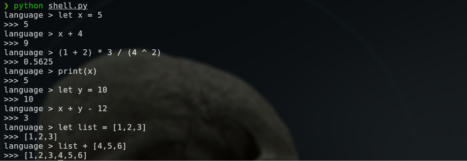

# my-own-programming-language
A basic interpreted language

To initialize, write in the console:
```
python shell.py
```

## Lexer

The lexer groups the input characters into small segments called tokens and identifies the type of each token, similarly to how we group letters into words such as nouns and verbs.

## Parser

The parser analyzes the sequence of tokens to determine what is intended to happen and in what order, similarly to how we make sense of sentences based on the sequence and types of words.

## Interpreter

The interpeter simply does what's intended according to the parser's results, and contains the code for all the different operations.

Examples of the syntax are shown in the images below.




